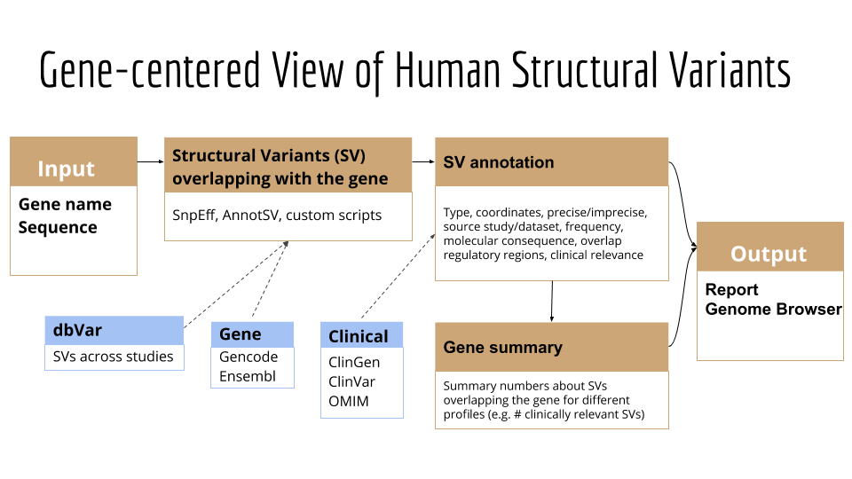

# GeneVar


## Goal

Develop a tool to facilitate a gene-centered view of human structural variants, which takes as input a gene name or id and produce a report / file / genome browser session that informs the user of all structural variants overlapping the gene and any non-coding regulatory elements affecting expression of the gene.

The tool is intended to have a clinical focus, in that it is intended to inform the interpretation of structural variants pertaining to the gene name provided by the user. 

## Draft flowchart



## Methods

Quick summary of the different modules. 
We (will) provide a script or a set of commands that were used to run each module. 

*These are far from being set in stone, please update along the way.*

### Link dbVar SVs to genes

- Input: 
  - All dbVar SVs (BED file including a *variant id* column)
  - Gene annotation: Gencode or Ensembl
- Output: 
  - TSV with two columns: `variant_id`, `gene_id`
  - Variant ids and gene ids may repeat.

Methods: 
Either extract this information from an annotation tool like SnpEff or AnnotSV, or use custom scripts using bedtools, R, python to perform the overlap.
The latter should be much faster to get exactly the information we want.

### Annotate gene impact

- Input:
  - All dbVar SVs or subset of SVs for one gene (using SV<->gene link computed above).
  - Gene annotation: Gencode or Ensembl
- Output: 
  - TSV with at least three columns: `variant_id`, `elt_type` (e.g. *UTR*, *exon*), `elt_info` (e.g. exon number)

Methods:
Similar as above.
It could maybe be done all in one module: overlap SVs and genes, extract variant-gene pairs and also variant-element pairs.

### Annotate allele frequency

- Input:
  - All dbVar SVs or subset of SVs for one gene (using SV<->gene link computed above).
  - gnomAD-SV VCF or BED file with allele frequency information
- Output: 
  - TSV with at least two columns: `variant_id`, `af`. 
  - Only for variants that were matched with the gnomAD-SV data.
  - Going further: extract frequency in super-populations in column: `af_AFR`, etc.
  - Going even further: match SVs from other studies with gnomAD-SV and annotate their frequency

Methods:
We might be able to match the dbVar and gnomAD-SV variants by variant ID.
Otherwise very stringent overlapping of the two should be able to match the variants.
We might need to use the hg19 version to match the original gnomAD-SV data to dbVar variants, and then make the connection to GRCh38 variants from dbVar (by variant ID?).

### Annotate overlap with clinically-relevant SVs

- Input:
  - All dbVar SVs or subset of SVs for one gene (using SV<->gene link computed above).
  - ClinGen or pathogenic SVs from ClinVar, etc
- Output: 
  - TSV with `variant_id` and TRUE/FALSE columns about their overlap. E.g.  `pathogenic_clinvar_sv`.

Methods:
Use either a simple overlap (any base overlapping) or reciprocal overlap (typically 50%).

### Annotate overlap with clinically-relevant SNVs/indels

- Input:
  - All dbVar SVs or subset of SVs for one gene (using SV<->gene link computed above).
  - ClinGen or pathogenic SNV/indels from ClinVar, etc
- Output: 
  - TSV with `variant_id` and TRUE/FALSE columns about their overlap. E.g.  `pathogenic_clinvar_sv`.

Methods:
Use either a simple overlap (any base overlapping) or reciprocal overlap (typically 50%).

### Gene-level summary

This could be done at the level of the report (below), or pre-computed in its own module.

- Input: 
  - All dbVar SVs
  - TSV with variant-gene pairs.
  - TSV with variant allele frequencies
  - TSV with gene impact annotation
  - TSV from other modules
- Output: 
  - A TSV with `gene_id` and one column per summary statistic. E.g. `common_sv_nb`.

### External resources for genes

We could pre-compute links to relevant resources for each genes. 
Some resources might require matching gene names.

- Input:
  - Gene IDs as used in the variant-gene pairs
  - Info from other resources: OMIM, gnomAD, ...
- Output:
  - A TSV with `gene_id` and one column with URLs to external resource. E.g. `omim_url`. 

### Report/browser

- Input: 
  - All dbVar SVs
  - TSV with variant-gene pairs.
  - TSV with variant allele frequencies
  - TSV with gene impact annotation
  - TSV from other modules
- Output: Not sure exactly yet but could be
  - ShinyApp to visualize data for one selected gene.
  - One webpage per gene in some kind of static HTML website
  - Some fancy browser, e.g. gnomAD-style
  
Methods:
TBD.
One option could be to use R+Shiny to deploy an app where the user can select a gene and visualize the SVs and stats.
Another option could be to make a static website that could be deployed on this GitHub repo (e.g. [R-Markdown website](https://bookdown.org/yihui/rmarkdown/rmarkdown-site.html) where each "gene" page automatically produced by script of our doing).

## Please cite our work -- here is the ICMJE Standard Citation:

### ...and a link to the DOI:

## Website (if applicable)

## Intro statement

## What's the problem?

## Why should we solve it?

# What is <this software>?

Overview Diagram

# How to use <this software>

# Software Workflow Diagram

# File structure diagram 
#### _Define paths, variable names, etc_

# Installation options:

We provide two options for installing <this software>: Docker or directly from Github.

### Docker

The Docker image contains <this software> as well as a webserver and FTP server in case you want to deploy the FTP server. It does also contain a web server for testing the <this software> main website (but should only be used for debug purposes).

1. `docker pull ncbihackathons/<this software>` command to pull the image from the DockerHub
2. `docker run ncbihackathons/<this software>` Run the docker image from the master shell script
3. Edit the configuration files as below

### Installing <this software> from Github

1. `git clone https://github.com/NCBI-Hackathons/<this software>.git`
2. Edit the configuration files as below
3. `sh server/<this software>.sh` to test
4. Add cron job as required (to execute <this software>.sh script)

### Configuration

```Examples here```

# Testing

We tested four different tools with <this software>. They can be found in [server/tools/](server/tools/) . 

# Additional Functionality

### DockerFile

<this software> comes with a Dockerfile which can be used to build the Docker image.

  1. `git clone https://github.com/NCBI-Hackathons/<this software>.git`
  2. `cd server`
  3. `docker build --rm -t <this software>/<this software> .`
  4. `docker run -t -i <this software>/<this software>`
  
### Website

There is also a Docker image for hosting the main website. This should only be used for debug purposes.

  1. `git clone https://github.com/NCBI-Hackathons/<this software>.git`
  2. `cd Website`
  3. `docker build --rm -t <this software>/website .`
  4. `docker run -t -i <this software>/website`
  
