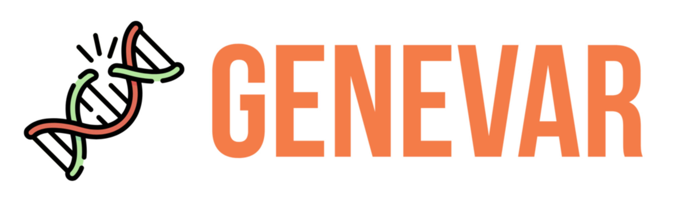
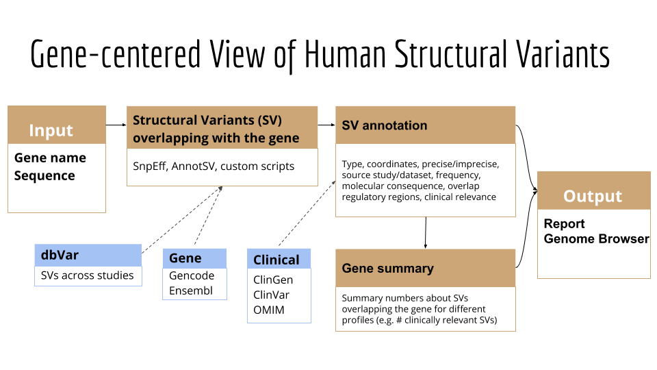
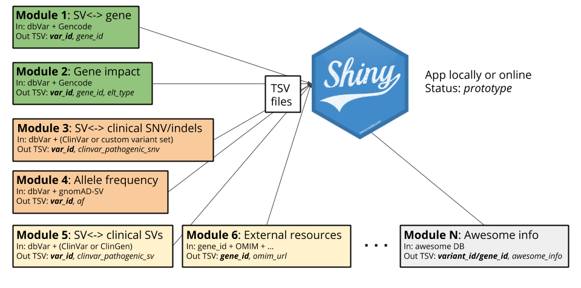
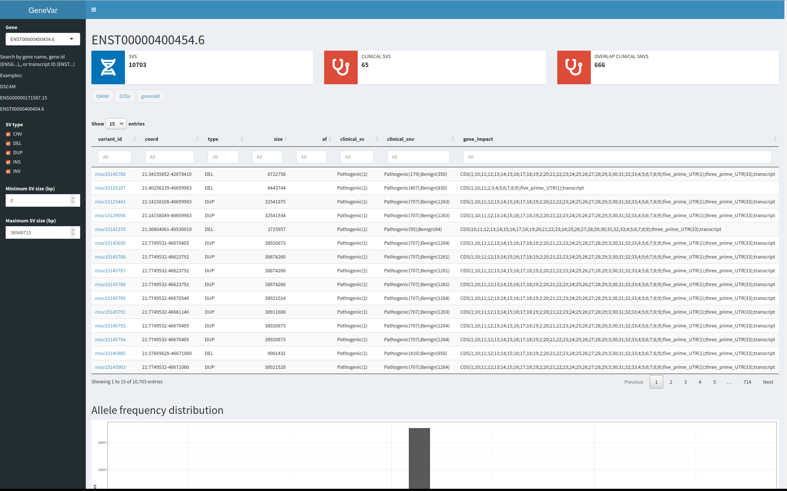

# GeneVar

## Demo

Live demo [here](http://courtyard.gi.ucsc.edu:3210/)

## Goal

Develop a tool to facilitate a **gene-centered view of human structural variants**, which takes as input a gene name or id and produce a report / file / genome browser session that informs the user of all structural variants overlapping the gene and any non-coding regulatory elements affecting expression of the gene.

The tool is **intended to have a clinical focus**, in that it is intended to inform the interpretation of structural variants pertaining to the gene name provided by the user. 

## Introduction

Next-generation sequencing provides the ability to sequence extended genomic regions or a whole-genome relatively cheaply and rapidly, making it a powerful technique to uncover the genetic architecture of diseases. 
However, there remain significant challenges, including interpreting and prioritizing the found variants and setting up the appropriate analysis pipeline to cover the necessary spectrum of genetic factors, which includes expansions, repeats, insertions/deletions (indels), structural variants and point mutations. 
For those outside the immediate field of genetics, a group that includes researchers, hospital staff, general practitioners, and increasingly, patients who have paid to have their genome sequenced privately, the interpretation of findings is particularly challenging. 
Although various tools are available to predict the pathogenicity of a protein-changing variant, they do not always agree, further compounding the problem. 
Furthermore, with the increasing availability of next-generation sequencing data, non-specialists, including health care professionals and patients, are obtaining their genomic information without a corresponding ability to analyse and interpret it as the relevance of novel or existing variants in genes is not always apparent. 
The same would be true of structural variant analysis, and its interpretation too requires care related to sample and platform selection, quality control, statistical analysis, results prioritisation, and replication strategy. 
Here we present GeneVar an open access, gene centric data browser for structural variant analysis. 

## Draft flowchart

## Results

At the end of the biocodathon, we have extracted info and build an app for chr21. 
It and integrates dbVar, GENCODE, ClinVar, gnomAD-SV. 
More modules will be added in the future.

## Methods

Scripts to prepare the data available in the [scripts](scripts) folder.
Code to run the Shiny app in the [shinyapp](shinyapp) folder.

## How it works

GeneVar is a web page application. 
After entering the gene name (HGNC, Ensembl gene (ENSG), or transcript (ENST) identifier) in the search box on the homepage, you will be directed to the gene-specific page containing:
1. Gene-level summary with number of SVs, number of clinival SVs or SVs overlapping clinical SNVs.
1. Links to the gene's page on OMIM, GTEx, gnomAD.
2. A dynamic table with the annotated variants overlapping the gene.
3. A graph with the distribution of the allele frequency for variants matched with gnomAD-SV (50% reciprocal overlap).

The profile of the SV to consider, such as type and size range, can be specified on the side bar.
Each column in the dynamic table can be "searched" into or reorder dynamically.
All data used by the app will be available for download in tab-delimited files. 
By default, allele frequency is reported based on gnomAD genomes and exomes.

## Software

GeneVar is available on GitHub (https://github.com/collaborativebioinformatics/GeneVar). 
The repository provides detailed instructions for tool usage and installation. 
A bash script for an automated installation of the required dependencies is also provided as well as Docker.
For now, the webpage runs on 1 core server with 1 Gb RAM and needs less than 1 Gb of storage.

## Future features

For now we link to these gene-centered resources.
In the future we could directly include some of their data:
- Averaged depth of coverage for sequencing experiments, e.g. from the gnomAD dataset
- Gene expression profiles extracted from GTEx.

The gene impact annotation could be improve, for example with amino acid change prediction, by integrating the following tools:
- [SnpEff](https://pcingola.github.io/SnpEff/)
- [AnnotSV](https://lbgi.fr/AnnotSV/)
- [OpenCRAVAT](https://opencravat.org/)

A different data exchange strategy will be necessary to scale up to the full genome and integrate more and more annotation.
The TSV files quickly become extremely large.
We are considering two options:
1. Tabix-indexed variants and on-the-fly comparison in the Shiny app.
   - Integrate all variant-level annotation into one BED-like file indexed for fast accession where each variant is present only once. For example, variant coordinates, allele frequencies, clinical flags.
   - The comparison with the gene annotation would be done on-the-fly in the app.
2. Switch to databases as suggested [here](https://shiny.rstudio.com/articles/overview.html).

### Link dbVar SVs to genes

- Input: 
  - All dbVar SVs (BED file including a *variant id* column)
  - Gene annotation: GENCODE or Ensembl
- Output: 
  - TSV with two columns: `variant_id`, `gene_id`
  - Variant ids and gene ids may repeat.

Methods: 
Either extract this information from an annotation tool like SnpEff or AnnotSV, or use custom scripts using bedtools, R, python to perform the overlap.
The latter should be much faster to get exactly the information we want.

### Annotate gene impact

- Input:
  - All dbVar SVs or subset of SVs for one gene (using SV<->gene link computed above).
  - Gene annotation: GENCODE or Ensembl
- Output: 
  - TSV with at least three columns: `variant_id`, `elt_type` (e.g. *UTR*, *exon*), `elt_info` (e.g. exon number)

Methods:
Similar as above.
It could maybe be done all in one module: overlap SVs and genes, extract variant-gene pairs and also variant-element pairs.

### Annotate allele frequency

- Input:
  - All dbVar SVs or subset of SVs for one gene (using SV<->gene link computed above).
  - gnomAD-SV VCF or BED file with allele frequency information
- Output: 
  - TSV with at least two columns: `variant_id`, `af`. 
  - Only for variants that were matched with the gnomAD-SV data.
  - Going further: extract frequency in super-populations in column: `af_AFR`, etc.
  - Going even further: match SVs from other studies with gnomAD-SV and annotate their frequency

Methods:
We might be able to match the dbVar and gnomAD-SV variants by variant ID.
Otherwise very stringent overlapping of the two should be able to match the variants.
We might need to use the hg19 version to match the original gnomAD-SV data to dbVar variants, and then make the connection to GRCh38 variants from dbVar (by variant ID?).

### Annotate overlap with clinically-relevant SVs

- Input:
  - All dbVar SVs or subset of SVs for one gene (using SV<->gene link computed above).
  - ClinGen or pathogenic SVs from ClinVar, etc
- Output: 
  - TSV with `variant_id` and TRUE/FALSE columns about their overlap. E.g.  `pathogenic_clinvar_sv`.

Methods:
Use either a simple overlap (any base overlapping) or reciprocal overlap (typically 50%).

### Annotate overlap with clinically-relevant SNVs/indels

- Input:
  - All dbVar SVs or subset of SVs for one gene (using SV<->gene link computed above).
  - ClinGen or pathogenic SNV/indels from ClinVar, etc
- Output: 
  - TSV with `variant_id` and TRUE/FALSE columns about their overlap. E.g.  `pathogenic_clinvar_sv`.

Methods:
Use either a simple overlap (any base overlapping) or reciprocal overlap (typically 50%).

### Gene-level summary

This could be done at the level of the report (below), or pre-computed in its own module.

- Input: 
  - All dbVar SVs
  - TSV with variant-gene pairs.
  - TSV with variant allele frequencies
  - TSV with gene impact annotation
  - TSV from other modules
- Output: 
  - A TSV with `gene_id` and one column per summary statistic. E.g. `common_sv_nb`.

### External resources for genes

We could pre-compute links to relevant resources for each genes. 
Some resources might require matching gene names.

- Input:
  - Gene IDs as used in the variant-gene pairs
  - Info from other resources: OMIM, gnomAD, ...
- Output:
  - A TSV with `gene_id` and one column with URLs to external resource. E.g. `omim_url`. 

### Report/browser

- Input: 
  - All dbVar SVs
  - TSV with variant-gene pairs.
  - TSV with variant allele frequencies
  - TSV with gene impact annotation
  - TSV from other modules
- Output: 
  - ShinyApp to visualize data for one selected gene.

See [shinyapp](shinyapp) folder for the code and commands.

Methods:
An application is implemented in R+Shiny where the user can select a gene and some filtering criteria for SVs (size and type).
A page is loaded with a summary of the SVs overlapping the gene, a table listing all annotated SVs, and a graph showing the distribution of allele frequencies.

## Data

- GRCh38
   - dbVar GRCh38 from: https://ftp.ncbi.nlm.nih.gov/pub/dbVar/data/Homo_sapiens/by_assembly/GRCh38/vcf/GRCh38.variant_call.all.vcf.gz
   - Clinical SVs: https://ftp.ncbi.nlm.nih.gov/pub/dbVar/data/Homo_sapiens/by_study/tsv/nstd102.GRCh38.variant_call.tsv.gz
   - ClinVar *where did the 32Mb clinvar.vcf.gz come from?*
   - GENCODE v35: ftp://ftp.ebi.ac.uk/pub/databases/gencode/Gencode_human/release_35/gencode.v35.annotation.gff3.gz
- GRCh37
   - dbVar GRCh37 from: https://ftp.ncbi.nlm.nih.gov/pub/dbVar/data/Homo_sapiens/by_assembly/GRCh37/vcf/GRCh37.variant_call.all.vcf.gz
   - gnomAD https://gnomad.broadinstitute.org
- Gene
   - OMIM https://www.ncbi.nlm.nih.gov/omim

